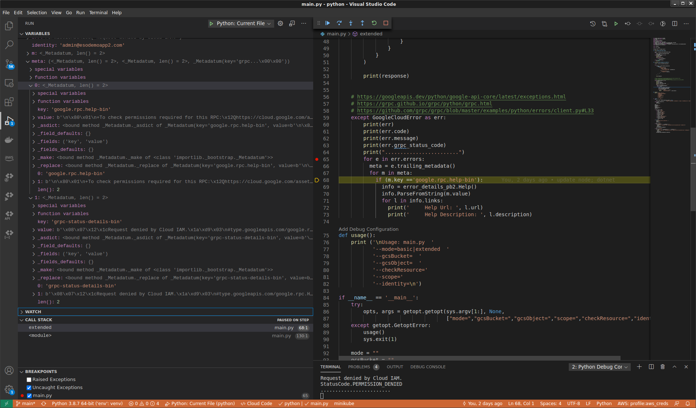

### Decoding GCP Errors Details

This article describes how to extract and use the embedded error messages provided by Google Cloud APIs.

As background, here is an enumeration of some the formatted errors you may see with REST api calls:

---

A) if you list pubsub topics and do not have permissions, you'd see

```json
curl -s -H "Authorization: Bearer `gcloud auth print-access-token`" https://pubsub.googleapis.com/v1/projects/fabled-ray-104117/topics
{
  "error": {
    "code": 403,
    "message": "User not authorized to perform this action.",
    "status": "PERMISSION_DENIED"
  }
}
```

**great...who is the user and what permissions do i need?**

---


B) if you try to list a GCS bucket that doesn't exist, you'd see a `NOT FOUND`

```json
$  curl -H "Authorization: Bearer `gcloud auth print-access-token`"  https://storage.googleapis.com/storage/v1/b/mineral-minutia-820-fooo
{
  "error": {
    "code": 404,
    "message": "Not Found",
    "errors": [
      {
        "message": "Not Found",
        "domain": "global",
        "reason": "notFound"
      }
    ]
  }
}
```

**whats not found? the bucket..how do i resolve it?**

---

C) if you try to access an object in GCS

```json
$ curl -H "Authorization: Bearer `gcloud auth print-access-token`"  https://storage.googleapis.com/storage/v1/b/fabled-ray-104117-bucket/o/foo.txt
{
  "error": {
    "code": 403,
    "message": "vault-seed-account@mineral-minutia-820.iam.gserviceaccount.com does not have storage.objects.get access to the Google Cloud Storage object.",
    "errors": [
      {
        "message": "vault-seed-account@mineral-minutia-820.iam.gserviceaccount.com does not have storage.objects.get access to the Google Cloud Storage object.",
        "domain": "global",
        "reason": "forbidden"
      }
    ]
  }
}
```

**Thats really good!...now i see who the user is and the permission!**

---

D) if you try to check access permissions using [Cloud Asset API](https://cloud.google.com/asset-inventory/docs/reference/rest)

```json
 curl  "https://cloudasset.googleapis.com/v1/projects/fabled-ray-104117:analyzeIamPolicy?analysisQuery.identitySelector.identity=user%3Auser4%40esodemoapp2.com&analysisQuery.resourceSelector.fullResourceName=%2F%2Fcompute.googleapis.com%2Fprojects%2Ffabled-ray-104117%2Fzones%2Fus-central1-a%2Finstances%2Fexternal"   --header "Authorization: Bearer $TOKEN"   --header 'Accept: application/json'

{
  "error": {
    "code": 403,
    "message": "Request denied by Cloud IAM.",
    "status": "PERMISSION_DENIED",
    "details": [
      {
        "@type": "type.googleapis.com/google.rpc.Help",
        "links": [
          {
            "description": "To check permissions required for this RPC:",
            "url": "https://cloud.google.com/asset-inventory/docs/access-control#required_permissions"
          },
          {
            "description": "To get a valid organization id:",
            "url": "https://cloud.google.com/resource-manager/docs/creating-managing-organization#retrieving_your_organization_id"
          },
          {
            "description": "To get a valid folder or project id:",
            "url": "https://cloud.google.com/resource-manager/docs/creating-managing-folders#viewing_or_listing_folders_and_projects"
          }
        ]
      }
    ]
  }
}
```


**Thats awesome!...look at all the embedded *details*, links in the error response!**

We're not done yet...the error details is a list of different types...for example, if you intentionally provide a malformed request (eg use `/v1/fooprojects/fabled-ray..` instead of `/v1/projects/fabled-ray`), you will see a slightly different response

```json
{
  "error": {
    "code": 400,
    "message": "Invalid parent in request.",
    "status": "INVALID_ARGUMENT",
    "details": [
      {
        "@type": "type.googleapis.com/google.rpc.BadRequest",
        "fieldViolations": [
          {
            "field": "parent",
            "description": "Invalid parent in request."
          }
        ]
      },
      {
        "@type": "type.googleapis.com/google.rpc.Help",
        "links": [
          {
            "description": "To check permissions required for this RPC:",
            "url": "https://cloud.google.com/asset-inventory/docs/access-control#required_permissions"
          },
          {
            "description": "To get a valid organization id:",
            "url": "https://cloud.google.com/resource-manager/docs/creating-managing-organization#retrieving_your_organization_id"
          },
          {
            "description": "To get a valid folder or project id:",
            "url": "https://cloud.google.com/resource-manager/docs/creating-managing-folders#viewing_or_listing_folders_and_projects"
          }
        ]
      }
    ]
  }
}
```

>> NOTE: This repository is *NOT* supported by Google.  Use these code samples as guides to wrap error handlers or to decode them, if necessary


This article shows how to unmarshall these errors by hand as well as my best attempt at wrapping a library that does the heavy lifting for you.  I am not by any stretch stating this these libraries are what you should use (since i do not know most of these languages in that detail).  If you see any improvements, please do file a git issue or preferably a pull request.

The library is basically a wrapper around the unmarshalling code and seeks to be back-compatible by a language's idiomatic handling of exceptions.
For more details, see the implementations sections

The underlying libraries uses core grpc clients for proto unmarshalling which _may_ cause dependency conflicts...so, more reason to use this with caution!

---

`Table of Contents`

* [Google API Error Design](#google-api-error-esign)
* [Services that return Error Details](#services-that-return-error-details)
* [Implementations](#implementations)
    - [gcloud](#gcloud)
    - [golang](#golang)
      - [Auto parsing Library](#auto-parsing-library)
      - [Default Client Error details](#default-client-error-details)
    * [Language Bindings](#language-bindings)
      - [python](#python)
      - [java](#java)
      - [nodejs](#nodejs)
      - [dotnet](#dotnet)

---

### Google API Error Design

Now, what are these details?

These are just standard and extended error responses Google APIs return (or should return).  The expectation is that all GCP APIs will eventually return meaningful errors in the format and structure described in [API Error Design](https://cloud.google.com/apis/design/errors) and [google.rpc](https://github.com/googleapis/googleapis/tree/master/google/rpc).  The format for the errors returned is a bit different depending on several factors such as the API in question and transport used (rest, grpc). As you can tell from the above examples, some APIs return more information than others..this article is about how to parse the detailed messages sent and a small library in golang that autoparses into a standard go `Error`. We will use REST and gRPC as the transports and GCS, PubSub, Compute and Asset API as examples and show how error message extraction works

GCS and Compute will demonstrate basic errors while Asset API will show us how to parse out complex error details from the gRPC response.

As a bit more background on the errors format,  the errors translates to the [googleapis.Error](https://pkg.go.dev/google.golang.org/api/googleapi#Error) golang struct shown below.

notice the`Details []interface{}` which is what we're after...thats where the embedded error details is transmitted as a proto during gRPC calls.


```golang
type Error struct {
	// Code is the HTTP response status code and will always be populated.
	Code int `json:"code"`
	// Message is the server response message and is only populated when
	// explicitly referenced by the JSON server response.
	Message string `json:"message"`
	// Details provide more context to an error.
	Details []interface{} `json:"details"`
	// Body is the raw response returned by the server.
	// It is often but not always JSON, depending on how the request fails.
	Body string
	// Header contains the response header fields from the server.
	Header http.Header

	Errors []ErrorItem
}

type ErrorItem struct {
	// Reason is the typed error code. For example: "some_example".
	Reason string `json:"reason"`
	// Message is the human-readable description of the error.
	Message string `json:"message"`
}
```

We'll use golang as a base language for concrete examples.  At the top level, when you catch a generic authentication or api error, you can inspect it for more base top level descriptions by casting to `googleapis.Error`.  For details, you need to go one step further and convert the returned proto to `googleapi.Error.Details` (see [error_details.proto](https://github.com/googleapis/googleapis/blob/master/google/rpc/error_details.proto)).  There are several types of details that could be returned:

* `ErrorInfo`: Provides structured error information that is both stable and extensible.
* `RetryInfo`: Describes when clients can retry a failed request, may be returned on `Code.UNAVAILABLE` or `Code.ABORTED`
* `QuotaFailure`: Describes how a quota check failed, may be returned on `Code.RESOURCE_EXHAUSTED`
* `BadRequest`: Describes violations in a client request, may be returned on `Code.INVALID_ARGUMENT`
* `Help`: Provides links to documentation or for performing an out of band action.

What do you mean "convert protos"?...Well, unfortunately, the error Details in gRPC calls is returned as an encoded [google.protobuf.Any*](https://developers.google.com/protocol-buffers/docs/proto3#any)...which means you need to carefuly extract them out

At time of writing, error Detail messages must be marshalled  out of `gRPC Metadata Trailers`.  Golang does this for you automatically but in the other languages, you need to extract the following fields to get at the embedded data.

For example,

* `grpc-status-help-bin`
* `grpc-status-badrequest-bin`
* `grpc-status-errorinfo-bin`

For example, in python, see the `help` errors here:



The value field in the screenshot above for `grpc-status-help-bin` trailer is actually an encoded protobuf of an Any type that needs to get converted into `google.rpc.Help`!...which is a pain but atleast in go it did detect and extract the field for you..in the other languages, you need to do this the really hard way.

In summary, what this repo seeks to do is to provide a way for your application to catch and use these embedded data...or atleast just log them.

We will start off with `gcloud`, then have bindings in golang, java, python, nodejs and dotnet and will be using `GOOGLE_APPLICATION_CREDENTIALS` environment variable and service accounts primarily.  

---

### Services that return Error Details

Not all GCP APIs return these error details.  While more and more APIs will return detailed/descriptive errors, the following is a current (4/11/21) supported:

- [Asset Inventory](https://cloud.google.com/asset-inventory/docs/reference/rest)

---


### Implementations

>> **IMPORTANT** DO NOT USE in production...this is just a sample


The implementation here seeks to provide a backward-compatible no-op library that you can 'just use' to handle and extract the detailed errors.


For example, if you currently catch a google error using a try catch block

```python
try:
  ...
except google.cloud.exceptions.GoogleCloudError as err:
  print(err)
  print(err.message)
except googleapiclient.errors.HttpError as err:
  print(err)
  print(err.status_code)
```

then applying the root error to this library should result in backwards output in not only printing the error but object methods that error originally provided

```python
from gcp_error_handler.gcp_errors import GCPError

try:
  ...
except google.cloud.exceptions.GoogleCloudError as err:
  ee = GCPError(err)
  print(ee)
  print(ee.message)
except googleapiclient.errors.HttpError as err:
  ee = GCPError(err)
  print(ee)
  print(ee.status_code)
```

The difference is if you enable an environment variable `export GOOGLE_ENABLE_ERROR_DETAIL=true`, then the output of the print() statements will automatically unmarshall any embedded error details and print to stdout.

Additionally, the `GCPError()` wrapper provides convenience methods to extract and process the error details as iterable objects:

```python
from gcp_error_handler.gcp_errors import GCPError

try:
  ...
except google.cloud.exceptions.GoogleCloudError as err:
  ee = GCPError(err)
  print(ee)
except googleapiclient.errors.HttpError as err:
  ee = GCPError(err,prettyprint=False)
  print(ee)  # export GOOGLE_ENABLE_ERROR_DETAIL=true
  print(ee.code)
  print(ee.message)
  print(ee.response)
  print(ee.grpc_status_code)
  print("Details: ")
  for e in ee.errors:
      if (ee.grpc_status_code != None):
          info = ee.get_google_rpc_help
          if info != None:
            for l in info.links:
              print('     Help Url: ', l.url)
              print('     Help Description: ', l.description)

          info = ee.get_google_rpc_badrequest
            if info != None:
              for l in info.field_violations:
                print('     BadRequest Field: ', l.field)
                print('     BadRequest Description: ', l.description)

```

The most clear awkwardness is with the bit above is using one class for multiple supers...but i'm looking for suggestion on improving this (maybe only wrap the class for `google.cloud.exceptions.GoogleCloudError`?)


>> **You can find detail examples for each implementation within the README.md in each folder library `python/README.md`, `java/README.md`, `node/README.md`, `dotnet/README.md`**


#### gcloud

`gcloud` cli by default does not use the environment variables for Application default credentials so we have to manually instruct it to use the service account

First download a service account and export the variables for application default credentials

```bash
export GOOGLE_APPLICATION_CREDENTIALS=/path/to/svc_account.json
export PROJECT_ID=`gcloud config get-value core/project`
export PROJECT_NUMBER=`gcloud projects describe $PROJECT_ID --format='value(projectNumber)'`
```

```bash
$ gcloud auth activate-service-account --key-file=/path/to/svc_account.json
```

Use gcloud to access GCS and Cloud Asset Inventory.  Notice the two formats for errors returned:

The GCS api does not return detailed messages such as the `type.googleapis.com/google.rpc.Help` structure so we see just basic data

```bash
$ gcloud alpha storage cp gs://fabled-ray-104117-bucket/foo.txt .

ERROR: gcloud crashed (GcsApiError): HTTPError 403: vault-seed-account@mineral-minutia-820.iam.gserviceaccount.com does not have storage.objects.get access to the Google Cloud Storage object.
```

The cloud asset api on the other hand does...and we see the error rendered in detail:

```bash
$ gcloud  asset analyze-iam-policy \
   --project $PROJECT_ID \
   --identity=user:admin@esodemoapp2.com \
   --full-resource-name="//cloudresourcemanager.googleapis.com/projects/$PROJECT_ID"

ERROR: (gcloud.asset.analyze-iam-policy) User [vault-seed-account@mineral-minutia-820.iam.gserviceaccount.com] does not have permission to access projects instance [fabled-ray-104117:analyzeIamPolicy] (or it may not exist): Request denied by Cloud IAM.
- '@type': type.googleapis.com/google.rpc.Help
  links:
  - description: 'To check permissions required for this RPC:'
    url: https://cloud.google.com/asset-inventory/docs/access-control#required_permissions
  - description: 'To get a valid organization id:'
    url: https://cloud.google.com/resource-manager/docs/creating-managing-organization#retrieving_your_organization_id
  - description: 'To get a valid folder or project id:'
    url: https://cloud.google.com/resource-manager/docs/creating-managing-folders#viewing_or_listing_folders_and_projects
```

#### Golang

Parsing the errors in golang is _relatively_ easy (meaning, its far easer than in the other languages i've used here).  In golang, the basic http errors you see for GCS and Compute can be directly casted over to [googleapis.Error](https://pkg.go.dev/google.golang.org/api/googleapi#Error):

eg
```golang
		storageClient, err := storage.NewClient(ctx)
		bkt := storageClient.Bucket(*gcsBucket)
		obj := bkt.Object(*gcsObject)
		r, err := obj.NewReader(ctx)
		if err != nil {
				if ee, ok := err.(*googleapi.Error); ok {
						fmt.Printf("Error Code %v", ee.Code)        
						fmt.Printf("Error Message %v", ee.Message)
						fmt.Printf("Error Details %v", ee.Details)
						fmt.Printf("Error Body %v", ee.Body)                                     
				}
		}
```

Yields basic information but no details:

```log
Error Code: 403
Error Message:
Error Details: []
Error Body: <?xml version='1.0' encoding='UTF-8'?><Error><Code>AccessDenied</Code><Message>Access denied.</Message><Details>vault-seed-account@mineral-minutia-820.iam.gserviceaccount.com does not have storage.objects.get access to the Google Cloud Storage object.</Details></Error>
2021/03/16 19:56:42 Errors:

```

To get details, we need ot invoke a different api an capture that data using [status.FromError()](https://pkg.go.dev/google.golang.org/grpc/status#FromError) and unmarshalled appropriately

```golang
if s, ok := status.FromError(err); ok {
		for _, d := range s.Proto().Details {
			switch d.TypeUrl {
			case "type.googleapis.com/google.rpc.Help":
				h := &errdetails.Help{}
				err = ptypes.UnmarshalAny(d, h)
				if err != nil {
					return err
				}
				for _, l := range h.Links {
					log.Printf("     ErrorHelp Description %s\n", l.Description)
					log.Printf("     ErrorHelp Url %s\n", l.Url)
				}
...      
```

You can see this using the provided sample and run:

```log
Proposed google.rpc.Help:
  google.rpc.Help.Description: To check permissions required for this RPC:
  google.rpc.Help.Url: https://cloud.google.com/asset-inventory/docs/access-control#required_permissions
  google.rpc.Help.Description: To get a valid organization id:
  google.rpc.Help.Url: https://cloud.google.com/resource-manager/docs/creating-managing-organization#retrieving_your_organization_id
  google.rpc.Help.Description: To get a valid folder or project id:
  google.rpc.Help.Url: https://cloud.google.com/resource-manager/docs/creating-managing-folders#viewing_or_listing_folders_and_projects
```

So for the details, you have to catch and unmarshall each of the potential types...this is a pain.

In go, i've wrapped these steps into a library of sorts which you can use in your code in a back-compatible way.

##### Auto parsing library

To help you along, i've setup an small library that will provide some convenience methods to do this unwrapping

The usage is pretty easy:  

```golang
import (
  gcperrors "github.com/salrashid123/gcp_error_handler/golang/errors"
)

func main() {
..
		bkt := storageClient.Bucket(*gcsBucket)
		obj := bkt.Object(*gcsObject)
		r, err := obj.NewReader(ctx)
		if err != nil {
			defEnv := gcperrors.New(gcperrors.Error{
				Err: err,
			})
			fmt.Printf("Error Details:\n %v\n", defEnv)
			return
		}
}
```

The `gcperrors.New()` return an unwrapped Error object that has several convenience methods

| Option | Description |
|:------------|-------------|
| **`New(err Error) *Error`** | Constructor to pass in the original error |
| **`Error() string`** | String value for the converted Error |
| **`GetGoogleAPIError() (*googleapi.Error, error)`** | Return raw `googleapi.Error`, if applicable  |
| **`GetStatus() (*status.Status, error)`** | Return raw `google.rpc.Status`, if applicable  |
| **`GetGoogleRPCHelp() (*errdetails.Help, error)`** | Return `google.rpc..Help` message if type is `google.rpc.Status`  |
| **`GetGoogleRPCErrorInfo() (*errdetails.ErrorInfo, error)`** | Return `google.rpc.ErrorInfo` message if type is `google.rpc.Status`  |
| **`GetGoogleRPCQuotaFailure() (*errdetails.QuotaFailure, error)`** | Return `google.rpc.QuotaFailure` message if type is `google.rpc.Status`  |
| **`GetGoogleRPCDebugInfo() (*errdetails.DebugInfo, error)`** | Return `google.rpc.DebugInfo` message if type is `google.rpc.Status`  |
| **`GetGoogleRPCRetryInfo() (*errdetails.RetryInfo, error)`** | Return `google.rpc.RetryInfo` message if type is `google.rpc.Status`  |
| **`GetGoogleRPCPreconditionFailure() (*errdetails.PreconditionFailure, error)`** | Return `google.rpc.PreconditionFailure` message if type is `google.rpc.Status`  |
| **`GetGoogleRPCBadRequest() (*errdetails.BadRequest, error)`** | Return `google.rpc.BadRequest` message if type is `google.rpc.Status`  |

Note the `Error()` will return a string and is just the plain [standard interface golang errors](https://blog.golang.org/go1.13-errors) need to adhere to.

The `Error` struct this library accepts has some default methods and properties

```golang
type Error struct {
	Err              error  // the original error
	PrettyPrint      bool   // prettyrint the json details
	IsGoogleAPIError bool   // is this a googleapis.Error
	IsStatusError    bool   // is this a Status
}
```

However, before you jump there are several things that should be on your mind:

1. Is this back compatible?
2. Can I enable this easily using something like an env-var?
3. Can this get included in the standard error returned by cloud libraries?

Lets start off with back compatibility.  The answer is yes because the library is designed to return the same error object it was passed to it by default.

The output of any error as returned by something like `fmt.Printf("%v",err)` will be the same with and wouthout the library.

for example, the output of

```golang
		bkt := storageClient.Bucket(*gcsBucket)
		obj := bkt.Object(*gcsObject)
		r, err := obj.NewReader(ctx)
    if err != nil {
			fmt.Printf("Default:\n%v\n", err)
			return
		}
```

Will give

```log
Default:
rpc error: code = PermissionDenied desc = Request denied by Cloud IAM.
```

Then when you pass the error into the library, you get the exact same output:

```golang
		bkt := storageClient.Bucket(*gcsBucket)
		obj := bkt.Object(*gcsObject)
		r, err := obj.NewReader(ctx)
		if err != nil {
				defEnv := gcperrors.New(gcperrors.Error{
				Err: err,
			})
			fmt.Printf("Default Proposed:\n%v\n", gerr)
			return
		}
```

```log
Default Proposed:
rpc error: code = PermissionDenied desc = Request denied by Cloud IAM.
```
This will help those customers that maybe using regex/string match on the error text.

...so, how do we enable the detailed parsing?

One way is to use an environment variable.  If you run the same code above but use

`export GOOGLE_ENABLE_ERROR_DETAIL=true`

The output will look like this:

```golang
	os.Setenv("GOOGLE_ENABLE_ERROR_DETAIL", "true")
	defEnv := gcperrors.New(gcperrors.Error{
		Err: err,
	})
	fmt.Printf("Default Proposed with env-var:\n %v\n", defEnv)
```

```log
Default Proposed with env-var:
 google.rpc.Error: {"code":7,"message":"Request denied by Cloud IAM.","details":[{"@type":"type.googleapis.com/google.rpc.Help","links":[{"description":"To check permissions required for this RPC:","url":"https://cloud.google.com/asset-inventory/docs/access-control#required_permissions"},{"description":"To get a valid organization id:","url":"https://cloud.google.com/resource-manager/docs/creating-managing-organization#retrieving_your_organization_id"},{"description":"To get a valid folder or project id:","url":"https://cloud.google.com/resource-manager/docs/creating-managing-folders#viewing_or_listing_folders_and_projects"}]}]}
```

So there it is...you can now atleast see the details...

We can go further still. What if you not only wanted the string format to display but you'd like that prettyprinted?

Well, then just set a flag:

```golang
		prettyErrors := gcperrors.New(gcperrors.Error{
			Err:         err,
			PrettyPrint: true,
		})
		fmt.Printf("Proposed PrettyPrint:\n %v\n", prettyErrors)
```

Gives:

```json
Proposed PrettyPrint:
 google.rpc.Error: PrettyPrint({
	"code": 7,
	"message": "Request denied by Cloud IAM.",
	"details": [
		{
			"@type": "type.googleapis.com/google.rpc.Help",
			"links": [
				{
					"description": "To check permissions required for this RPC:",
					"url": "https://cloud.google.com/asset-inventory/docs/access-control#required_permissions"
				},
				{
					"description": "To get a valid organization id:",
					"url": "https://cloud.google.com/resource-manager/docs/creating-managing-organization#retrieving_your_organization_id"
				},
				{
					"description": "To get a valid folder or project id:",
					"url": "https://cloud.google.com/resource-manager/docs/creating-managing-folders#viewing_or_listing_folders_and_projects"
				}
			]
		}
	]
})
```

Thats nice...but I want to get the actual proto messages itself to do something..

For that, you can use the methods described


```golang
	gerr := gcperrors.New(gcperrors.Error{
		Err: err,
	})
	if gerr.IsStatusError {
		fmt.Printf("Proposed google.rpc.Help:\n")
		h, err := gerr.GetGoogleRPCHelp()
		if err != nil {
			fmt.Printf("%v\n", err)
		} else {

			for _, v := range h.Links {
				fmt.Printf("  google.rpc.Help.Description: %s\n", v.Description)
				fmt.Printf("  google.rpc.Help.Url: %s\n", v.Url)
			}
		}
		fmt.Printf("Proposed google.rpc.BadRequest:\n")
		b, err := gerr.GetGoogleRPCBadRequest()
		if err != nil {
			fmt.Printf("%v\n", err)
		} else {

			for _, v := range b.FieldViolations {
				fmt.Printf("  google.rpc.BadRequest.FieldViolations.Field: %s\n", v.Field)
				fmt.Printf("  google.rpc.BadRequest.FieldViolations.Description: %s\n", v.Description)
			}
		}
	}
```

Will give

```log
Proposed google.rpc.Help:
  google.rpc.Help.Description: To check permissions required for this RPC:
  google.rpc.Help.Url: https://cloud.google.com/asset-inventory/docs/access-control#required_permissions
  google.rpc.Help.Description: To get a valid organization id:
  google.rpc.Help.Url: https://cloud.google.com/resource-manager/docs/creating-managing-organization#retrieving_your_organization_id
  google.rpc.Help.Description: To get a valid folder or project id:
  google.rpc.Help.Url: https://cloud.google.com/resource-manager/docs/creating-managing-folders#viewing_or_listing_folders_and_projects
Proposed google.rpc.BadRequest:
grpc/status.Status does not include type.googleapis.com/google.rpc.BadRequest
```

---

##### Default Client Error details

ok, we've talked about how to use this library by hand but it'd be nice if its automatically returned by Google Libraries.

meaning, a proposal maybe that instead of the [Default Error response](https://github.com/googleapis/google-cloud-go/blob/c3de0b796c65bdb1cc54861b15c3126f2b68c667/asset/apiv1/asset_client.go#L440) for any given library,

```golang
		err := gax.Invoke(ctx, func(ctx context.Context, settings gax.CallSettings) error {
			var err error
			resp, err = c.client.SearchAllResources(ctx, req, settings.GRPC...)
			return err
    }, opts...)
```

We actually rewrap the error by extracting it first:

```golang
		err := gax.Invoke(ctx, func(ctx context.Context, settings gax.CallSettings) error {
			var err error
			resp, err = c.client.SearchAllResources(ctx, req, settings.GRPC...)
			return gcperrors.New(gcperrors.Error{
							Err: err,
						})
    }, opts...)
```

Since using the wrapped library is a no-op unless you set an env-var, it should generally be transparent.

(you can also chain `gcperrors.New()` together so you can optionally prettyprint or do other things after the default library does its stuff)

---

Now, you can test out all this in go using the sample `main.go` provided here.  Pay seecific attention to the steps in `runTestCases()` method.

To use,

```bash
export PROJECT_ID=`gcloud config get-value core/project`
export PROJECT_NUMBER=`gcloud projects describe $PROJECT_ID --format='value(projectNumber)'`

# REST
go run main.go  --api=gcs  --gcsBucket fabled-ray-104117-bucket --gcsObject foo.txt
go run main.go  --api=compute --computeZone us-central1-a  --projectID $PROJECT_ID
# GRPC
go run main.go  --api=pubsub --projectID  $PROJECT_ID
go run main.go  --api=asset  --checkResource="//cloudresourcemanager.googleapis.com/projects/$PROJECT_ID" --identity="user:someuser@domain.com" --scope="projects/$PROJECT_ID"
```

Note, the pubsub api call also supports redirecting redirecting quota information with the `--quotaProject=` parameter.  What that allows you to see is an errorInfo that includes service status, for example

```bash
$ curl -s -H "X-Goog-User-Project: 87380058272"  \
   -X PUT -H "Authorization: Bearer `gcloud auth application-default print-access-token`" \
   "https://pubsub.googleapis.com/v1/projects/test-pbusub-11/topics/topic1"

{
  "error": {
    "code": 403,
    "message": "Cloud Pub/Sub API has not been used in project 87380058272 before or it is disabled. Enable it by visiting https://console.developers.google.com/apis/api/pubsub.googleapis.com/overview?project=87380058272 then retry. If you enabled this API recently, wait a few minutes for the action to propagate to our systems and retry.",
    "status": "PERMISSION_DENIED",
    "details": [
      {
        "@type": "type.googleapis.com/google.rpc.Help",
        "links": [
          {
            "description": "Google developers console API activation",
            "url": "https://console.developers.google.com/apis/api/pubsub.googleapis.com/overview?project=87380058272"
          }
        ]
      },
      {
        "@type": "type.googleapis.com/google.rpc.ErrorInfo",
        "reason": "SERVICE_DISABLED",
        "domain": "googleapis.com",
        "metadata": {
          "service": "pubsub.googleapis.com",
          "consumer": "projects/87380058272"
        }
      }
    ]
  }
}
```

in go, that would be 

```golang
$  go run main.go --api=pubsub --projectID test-pbusub-11 --topicName=topic1 --quotaProject 87380058272

Default:
rpc error: code = PermissionDenied desc = Cloud Pub/Sub API has not been used in project 87380058272 before or it is disabled. Enable it by visiting https://console.developers.google.com/apis/api/pubsub.googleapis.com/overview?project=87380058272 then retry. If you enabled this API recently, wait a few minutes for the action to propagate to our systems and retry.
------------------------------------
Default Proposed:
rpc error: code = PermissionDenied desc = Cloud Pub/Sub API has not been used in project 87380058272 before or it is disabled. Enable it by visiting https://console.developers.google.com/apis/api/pubsub.googleapis.com/overview?project=87380058272 then retry. If you enabled this API recently, wait a few minutes for the action to propagate to our systems and retry.
------------------------------------
Default Proposed with env-var:
 google.rpc.Error: {"code":7,"message":"Cloud Pub/Sub API has not been used in project 87380058272 before or it is disabled. Enable it by visiting https://console.developers.google.com/apis/api/pubsub.googleapis.com/overview?project=87380058272 then retry. If you enabled this API recently, wait a few minutes for the action to propagate to our systems and retry.","details":[{"@type":"type.googleapis.com/google.rpc.Help","links":[{"description":"Google developers console API activation","url":"https://console.developers.google.com/apis/api/pubsub.googleapis.com/overview?project=87380058272"}]},{"@type":"type.googleapis.com/google.rpc.ErrorInfo","reason":"SERVICE_DISABLED","domain":"googleapis.com","metadata":{"consumer":"projects/87380058272","service":"pubsub.googleapis.com"}}]}
------------------------------------
Proposed PrettyPrint:
 google.rpc.Error: PrettyPrint({
	"code": 7,
	"message": "Cloud Pub/Sub API has not been used in project 87380058272 before or it is disabled. Enable it by visiting https://console.developers.google.com/apis/api/pubsub.googleapis.com/overview?project=87380058272 then retry. If you enabled this API recently, wait a few minutes for the action to propagate to our systems and retry.",
	"details": [
		{
			"@type": "type.googleapis.com/google.rpc.Help",
			"links": [
				{
					"description": "Google developers console API activation",
					"url": "https://console.developers.google.com/apis/api/pubsub.googleapis.com/overview?project=87380058272"
				}
			]
		},
		{
			"@type": "type.googleapis.com/google.rpc.ErrorInfo",
			"reason": "SERVICE_DISABLED",
			"domain": "googleapis.com",
			"metadata": {
				"consumer": "projects/87380058272",
				"service": "pubsub.googleapis.com"
			}
		}
	]
})
------------------------------------
Proposed google.rpc.Help:
  google.rpc.Help.Description: Google developers console API activation
  google.rpc.Help.Url: https://console.developers.google.com/apis/api/pubsub.googleapis.com/overview?project=87380058272
Proposed google.rpc.BadRequest:
grpc/status.Status does not include type.googleapis.com/google.rpc.BadRequest
Proposed google.rpc.ErrorInfo:
  google.rpc.ErrorInfo.Domain: googleapis.com
  google.rpc.ErrorInfo.Reason: SERVICE_DISABLED
  google.rpc.ErrorInfo.Metadata  Key: consumer  Value: projects/87380058272
  google.rpc.ErrorInfo.Metadata  Key: service  Value: pubsub.googleapis.com
```

---
---

### Language Bindings

The rest of this repo contains baseline samples that *just parses the error details*...not thing more.  I do not know enough of the following to know how to wrap its idiomatic errors together

>> *If you know how to properly wrap errors in any of these languages, please feel free to file a PR*

The hard part is catching the gRPC metadata trailers and casting them so i think most of the work is done.  That is, catch the metdata, look for a `key="google.rpc.help-bin"`, unmarshall the proto

Code snippets below uses the projectID and user I have in a test domain...if you're just interested in seeing the error mode, just bootstrap the same clients using your credential against my test project..you'll see the errors since you dont' have access.
#### Python


Basic top-level errors can be caught by directly using [google.cloud.exceptions.GoogleCloudError](https://gcloud.readthedocs.io/en/latest/_modules/google/cloud/exceptions.html)

The snippet below will list out the REST errors you'd see with something like GCS:

>> NOTE, for convenience, this repo includes a library under `python/gcp_error_handler/gcp_errors.py` which wraps and surfaces the detail errors.  For more details, see `python/README.md`

```python
    bucket = storage_client.bucket(bucket_name)
    try:
        blob = bucket.get_blob(object_name)
        print(blob)
    except GoogleCloudError as err:
        print(err.code)
        print([err])
        print("Details: ")
        for e in err.errors:
            for k, v in e.items():
                print(k, v)
    except Exception as err:
        print(err)
```

```log
$ python main.py --api=gcs      --gcsBucket fabled-ray-104117-bucket      --gcsObject foo.txt

HTTPStatus.FORBIDDEN
[Forbidden('GET https://storage.googleapis.com/storage/v1/b/fabled-ray-104117-bucket/o/foo.txt?projection=noAcl&prettyPrint=false: vault-seed-account@mineral-minutia-820.iam.gserviceaccount.com does not have storage.objects.get access to the Google Cloud Storage object.')]
Details:
  message vault-seed-account@mineral-minutia-820.iam.gserviceaccount.com does not have storage.objects.get access to the Google Cloud Storage object.
  domain global
  reason forbidden
```

For detail gRPC Status, thats done by casting using `GoogleCloudError` methods then extract from the [grpc.Status](https://grpc.github.io/grpc/python/grpc_status.html) fields from the trailing metadata

For example
-
```python
except GoogleCloudError as err:    
    print(err)
    print(err.code)
    print(err.message)
    print(err.grpc_status_code)
    print("........................")
    for e in err.errors:
      meta = e.trailing_metadata()
      for m in meta:
        if (m.key =='google.rpc.help-bin'):
          info = error_details_pb2.Help()
          info.ParseFromString(m.value)
          for l in info.links:
            print('     Help Url: ', l.url)
            print('     Help Description: ', l.description)
```

You can run the sample using python3

```bash
python main.py --api=asset \
   --checkResource="//cloudresourcemanager.googleapis.com/projects/fabled-ray-104117"   \
   --identity=user:admin@esodemoapp2.com  \
   --scope=projects/fabled-ray-104117
```

gives output

```log
403 Request denied by Cloud IAM.
HTTPStatus.FORBIDDEN
Request denied by Cloud IAM.
StatusCode.PERMISSION_DENIED
........................
     Help Url:  https://cloud.google.com/asset-inventory/docs/access-control#required_permissions
     Help Description:  To check permissions required for this RPC:
     Help Url:  https://cloud.google.com/resource-manager/docs/creating-managing-organization#retrieving_your_organization_id
     Help Description:  To get a valid organization id:
     Help Url:  https://cloud.google.com/resource-manager/docs/creating-managing-folders#viewing_or_listing_folders_and_projects
     Help Description:  To get a valid folder or project id:
```

#### Java

>> NOTE, for convenience, this repo includes a library under `java/src/main/java/com/github/salrashid123/gcp_error_handler/ErrorHandler.java` which wraps and surfaces the detail errors.  For more details, see `java/README.md`

For basic/REST exception with something like GCS, use [com.google.cloud.storage.StorageException](https://googleapis.dev/java/google-cloud-storage/latest/com/google/cloud/storage/StorageException.html)


```java
        try {
            Storage storage = StorageOptions.newBuilder().build().getService();
            Blob blob = storage.get(BlobId.of(bucketName, objectName));
            String value = new String(blob.getContent());
            System.out.println(value);

        } catch (StorageException ex) {
            System.out.println("StorageException: ");
            System.out.println("  Code: " + ex.getCode());
            System.out.println("  Message: " + ex.getMessage());
            System.out.println("  DebugInfo: " + ex.getDebugInfo());
            System.out.println("  Location: " + ex.getLocation());
            System.out.println("  Reason: " + ex.getReason());
            // System.out.println(" Cause: " + ex.getCause());
        } catch (Exception ex) {
            System.out.println("Exception:  " + ex);
        }
```

```log
mvn clean install exec:java -q \
   -Dexec.args="-mode basic -gcsBucket fabled-ray-104117-bucket -gcsObject foo.txt"

StorageException:
  Code: 403
  Message: vault-seed-account@mineral-minutia-820.iam.gserviceaccount.com does not have storage.objects.get access to the Google Cloud Storage object.
  DebugInfo: null
  Location: null
  Reason: forbidden
```

For `error.Detail` parsing, we need to populate [io.grpc.Status](https://grpc.github.io/grpc-java/javadoc/io/grpc/Status.html) from the grpc.Metadata Trailers:


```java
        try {
            AssetServiceClient client = AssetServiceClient.create();
            AnalyzeIamPolicyRequest request = AnalyzeIamPolicyRequest.newBuilder()
                    .setAnalysisQuery(IamPolicyAnalysisQuery.newBuilder().setScope(scope)
                            .setIdentitySelector(IdentitySelector.newBuilder().setIdentity(identity).build())
                            .setResourceSelector(
                                    ResourceSelector.newBuilder().setFullResourceName(checkResource).build()))
                    .build();

            AnalyzeIamPolicyResponse response = client.analyzeIamPolicy(request);
            System.out.println(response);
        } catch (Exception ex) {
            System.out.println("Exception:");
            Status ss = Status.fromThrowable(ex);
            System.out.println("  Status.getCode:  " + ss.getCode().value());
            System.out.println("  Status.getDescription:  " + ss.getDescription());
            Metadata m = Status.trailersFromThrowable(ex);

            for (String k : m.keys()) {
                if (k.equals("google.rpc.help-bin")) {
                    byte[] byt_help = m.get(Metadata.Key.of("google.rpc.help-bin", Metadata.BINARY_BYTE_MARSHALLER));
                    Help h = null;
                    try {
                      h = Help.parseFrom(byt_help);
                    } catch (InvalidProtocolBufferException ioex) {
                        System.out.println("err" + ioex);
                        return;
                    }
                    for (Help.Link l : h.getLinksList()){
                        System.out.println("     Exception Link getDescription:  " + l.getDescription());
                        System.out.println("     Exception Link getUrl:  " + l.getUrl());                        
                    }                    
                }
            }
        }
```

Sample output is:

```bash
mvn clean install exec:java -q \
   -Dexec.args="-mode extended -checkResource //cloudresourcemanager.googleapis.com/projects/fabled-ray-104117 -identity user:admin@esodemoapp2.com -scope projects/fabled-ray-104117"


Exception:
  Status.getCode:  7
  Status.getDescription:  Request denied by Cloud IAM.
   Parsing: grpc-server-stats-bin
   Parsing: google.rpc.help-bin
     Exception Link getDescription:  To check permissions required for this RPC:
     Exception Link getUrl:  https://cloud.google.com/asset-inventory/docs/access-control#required_permissions
     Exception Link getDescription:  To get a valid organization id:
     Exception Link getUrl:  https://cloud.google.com/resource-manager/docs/creating-managing-organization#retrieving_your_organization_id
     Exception Link getDescription:  To get a valid folder or project id:
     Exception Link getUrl:  https://cloud.google.com/resource-manager/docs/creating-managing-folders#viewing_or_listing_folders_and_projects
   Parsing: grpc-status-details-bin
```

#### NodeJS

For REST errors, you can directly extract the error information without unmarshalling.  The `err` is actually a `googleapi Error`

```javascript
  const {Storage} = require('@google-cloud/storage');
  const storage = new Storage();
  var file =  storage.bucket(bucketName).file(objectName);
  file.download(function(err, contents) {

      if (err) {
        // err is ApiError
        console.log("Error Code: " + err.code);
        console.log("Error Message: " + err.message);
        console.log("Error Errors: " + err.errors);
      }  else {
        console.log("file data: " + contents);   
      }
  });
```

```bash
$ node main.js --mode=basic --gcsBucket=fabled-ray-104117-bucket --gcsObject=foo.txt

Error Code: 403
Error Message: vault-seed-account@mineral-minutia-820.iam.gserviceaccount.com does not have storage.objects.get access to the Google Cloud Storage object.
Error Errors:
```


Detail Messages are embedded inside the metadata fields of the RPC.  For example,

```javascript
const result =  client.analyzeIamPolicy(request, options).then(function(value) {
  console.log(util.inspect(value, {depth: null}));
}, function(err) {
  console.log('Code: ' + err.code);
  console.log('Details: ' + err.details);
  console.log('Message: ' + err.message);  

  if (err.metadata) {
    // TODO: deserialize to approprate @type:      
    const help_bytes = err.metadata.get('google.rpc.help-bin');
    const protos = require('google-proto-files');
    protos.load('./node_modules/google-proto-files/google/rpc/error_details.proto').then(function(root) {
      const helpdef = root.lookup("google.rpc.Help");
      const help = helpdef.decode(help_bytes[0])
      help.links.forEach(element => {
        console.log(element.description);
        console.log(element.url);
      })
    }, function(err){
      console.log(err)
    }) ;
  }

});  
}
```

gives the error details but I'm not sure how to unmarshal in node properly


```bash
$ node main.js --mode=extended \
  --checkResource=//cloudresourcemanager.googleapis.com/projects/fabled-ray-104117 \
  --identity=user:admin@esodemoapp2.com \
  --scope=projects/fabled-ray-104117


Code: 7
Details: Request denied by Cloud IAM.
Message: 7 PERMISSION_DENIED: Request denied by Cloud IAM.
To check permissions required for this RPC:
https://cloud.google.com/asset-inventory/docs/access-control#required_permissions
To get a valid organization id:
https://cloud.google.com/resource-manager/docs/creating-managing-organization#retrieving_your_organization_id
To get a valid folder or project id:
https://cloud.google.com/resource-manager/docs/creating-managing-folders#viewing_or_listing_folders_and_projects
```


#### dotnet

Same with dotnet:
  Catching basic errors in GCS is pretty straightforward using [Google.GoogleApiException](https://googleapis.dev/dotnet/Google.Apis.Core/latest/api/Google.GoogleApiException.html)

```csharp
            var storage = StorageClient.Create();
            try
            {
                storage.DownloadObject(bucketName, objectName, Console.OpenStandardOutput());
            }
            catch (Google.GoogleApiException e)
            {
                Console.WriteLine("Message: " + e.Message);
                Console.WriteLine("ServiceName: " + e.ServiceName);
                Console.WriteLine("Source: " + e.Source);
                Console.WriteLine("HttpStatusCode: " + e.HttpStatusCode);
                Console.WriteLine("HelpLink: " + e.HelpLink);
                Console.WriteLine("Error: " + e.Error);
            }
```

```bash
$ dotnet --version
3.1.302

$ dotnet run --mode=basic --gcsBucket=fabled-ray-104117-bucket --gcsObject=foo.txt

Message: vault-seed-account@mineral-minutia-820.iam.gserviceaccount.com does not have storage.objects.get access to the Google Cloud Storage object.
ServiceName: storage
Source: Google.Cloud.Storage.V1
HttpStatusCode: Forbidden
HelpLink:
Error:
```

For the Status fields, you still have to unmarshal from the trailers

```bash
$ dotnet run --mode=extended \
  --checkResource=//cloudresourcemanager.googleapis.com/projects/fabled-ray-104117 \
  --identity=user:admin@esodemoapp2.com \
  --scope=projects/fabled-ray-104117
```

>> TODO: i'm not sure how to do this...the following works but is pretty inefficient

```csharp
            try
            {
                AnalyzeIamPolicyRequest request = new AnalyzeIamPolicyRequest
                {
                    AnalysisQuery = new IamPolicyAnalysisQuery
                    {
                        Scope = scope,
                        IdentitySelector = new IamPolicyAnalysisQuery.Types.IdentitySelector
                        {
                            Identity = identity,
                        },
                        ResourceSelector = new IamPolicyAnalysisQuery.Types.ResourceSelector
                        {
                            FullResourceName = checkResource,
                        }

                    },
                };
                var response = client.AnalyzeIamPolicy(request);
                Console.WriteLine(response);
            }
            catch (Grpc.Core.RpcException e)
            {
                Console.WriteLine("Message: " + e.Message);
                Console.WriteLine("Status: " + e.Status);

                Console.WriteLine("Status.StatusCode: " + e.Status.StatusCode);
                Console.WriteLine("Status.Detail: " + e.Status.Detail);

                PrintRpcExceptionDetails(e);
            }
        }
        // https://github.com/chwarr/grpc-dotnet-google-rpc-status/blob/master/client/Program.cs
        private static void PrintRpcExceptionDetails(RpcException ex)
        {
            byte[]? statusBytes = null;

            foreach (Metadata.Entry me in ex.Trailers)
            {

                if (me.Key == StatusDetailsTrailerName)
                {
                    statusBytes = me.ValueBytes;
                }
            }

            if (statusBytes is null)
            {
                return;
            }

            var status = Google.Rpc.Status.Parser.ParseFrom(statusBytes);

            foreach (Any any in status.Details)
            {
                PrintRPCDetails(any);
            }
        }

        private static void PrintRPCDetails(Any any)
        {
            if (any.TryUnpack(out Google.Rpc.BadRequest br))
            {
                Console.WriteLine($"  BadRequest {br}");                
            }
            else if (any.TryUnpack(out Google.Rpc.PreconditionFailure pf))
            {
                Console.WriteLine($"  PreconditionFailure {pf}");
            } else if (any.TryUnpack(out Google.Rpc.Help h))
            {                
                foreach (Types.Link l in h.Links)
                {
                    Console.WriteLine("    Description: " + l.Description);
                    Console.WriteLine("    URL: " + l.Url);                    
                }
            }
        }
```

```log
Status.StatusCode: PermissionDenied
Status.Detail: Request denied by Cloud IAM.
    Description: To check permissions required for this RPC:
    URL: https://cloud.google.com/asset-inventory/docs/access-control#required_permissions
    Description: To get a valid organization id:
    URL: https://cloud.google.com/resource-manager/docs/creating-managing-organization#retrieving_your_organization_id
    Description: To get a valid folder or project id:
    URL: https://cloud.google.com/resource-manager/docs/creating-managing-folders#viewing_or_listing_folders_and_projects
```


---

`=========================================================`

---

### Summary

In summary, ther'es a log of really useful debugging information some GCP apis return...but its really, really difficult to even see and is hidden under unnecessary layers of abstraction almost all developers (me included)...simply don't want to carry the cognitive load for).

Hopefully, these errors will get returned by default and a simple `print` command on the error will show the details...the first step is to just show the errors easily..the next steps is to allow easier conditional actions based on the appropriate errors google apis send back.


```log
2021/03/28 22:13:13 ================ Using  (AssetManager) ======================
2021/03/28 22:13:14 http2: Framer 0xc0002668c0: wrote SETTINGS len=0
2021/03/28 22:13:14 http2: Framer 0xc0002668c0: read SETTINGS len=18, settings: MAX_CONCURRENT_STREAMS=100, INITIAL_WINDOW_SIZE=1048576, MAX_HEADER_LIST_SIZE=16384
2021/03/28 22:13:14 http2: Framer 0xc0002668c0: read WINDOW_UPDATE len=4 (conn) incr=983041
2021/03/28 22:13:14 http2: Framer 0xc0002668c0: read SETTINGS flags=ACK len=0
2021/03/28 22:13:14 http2: Framer 0xc0002668c0: wrote SETTINGS flags=ACK len=0
2021/03/28 22:13:14 http2: Framer 0xc0002668c0: wrote HEADERS flags=END_HEADERS stream=1 len=867
2021/03/28 22:13:14 http2: Framer 0xc0002668c0: wrote DATA flags=END_STREAM stream=1 len=138 data="\x00\x00\x00\x00\x85\n\x82\x01\n\x1cprojects/mineral-minutia-820\x12D\nB//cloudresourcemanager.googleapis.com/projects/mineral-minutia-820\x1a\x1c\n\x1auser:admin@esodemoapp2.com"
2021/03/28 22:13:14 http2: Framer 0xc0002668c0: read HEADERS flags=END_HEADERS stream=1 len=228
2021/03/28 22:13:14 http2: decoded hpack field header field ":status" = "200"
2021/03/28 22:13:14 http2: decoded hpack field header field "content-type" = "application/grpc"
2021/03/28 22:13:14 http2: decoded hpack field header field "grpc-accept-encoding" = "identity,deflate,gzip"
2021/03/28 22:13:14 http2: decoded hpack field header field "accept-encoding" = "identity,gzip"
2021/03/28 22:13:14 http2: decoded hpack field header field "content-length" = "0"
2021/03/28 22:13:14 http2: decoded hpack field header field "date" = "Mon, 29 Mar 2021 02:13:14 GMT"
2021/03/28 22:13:14 http2: decoded hpack field header field "alt-svc" = "h3-29=\":443\"; ma=2592000,h3-T051=\":443\"; ma=2592000,h3-Q050=\":443\"; ma=2592000,h3-Q046=\":443\"; ma=2592000,h3-Q043=\":443\"; ma=2592000,quic=\":443\"; ma=2592000; v=\"46,43\""
2021/03/28 22:13:14 http2: Framer 0xc0002668c0: read HEADERS flags=END_STREAM|END_HEADERS stream=1 len=1130
2021/03/28 22:13:14 http2: decoded hpack field header field "grpc-status" = "7"
2021/03/28 22:13:14 http2: decoded hpack field header field "grpc-message" = "Request denied by Cloud IAM."
2021/03/28 22:13:14 http2: decoded hpack field header field "google.rpc.help-bin" = "CoABCitUbyBjaGVjayBwZXJtaXNzaW9ucyByZXF1aXJlZCBmb3IgdGhpcyBSUEM6ElFodHRwczovL2Nsb3VkLmdvb2dsZS5jb20vYXNzZXQtaW52ZW50b3J5L2RvY3MvYWNjZXNzLWNvbnRyb2wjcmVxdWlyZWRfcGVybWlzc2lvbnMKkAEKH1RvIGdldCBhIHZhbGlkIG9yZ2FuaXphdGlvbiBpZDoSbWh0dHBzOi8vY2xvdWQuZ29vZ2xlLmNvbS9yZXNvdXJjZS1tYW5hZ2VyL2RvY3MvY3JlYXRpbmctbWFuYWdpbmctb3JnYW5pemF0aW9uI3JldHJpZXZpbmdfeW91cl9vcmdhbml6YXRpb25faWQKmAEKJFRvIGdldCBhIHZhbGlkIGZvbGRlciBvciBwcm9qZWN0IGlkOhJwaHR0cHM6Ly9jbG91ZC5nb29nbGUuY29tL3Jlc291cmNlLW1hbmFnZXIvZG9jcy9jcmVhdGluZy1tYW5hZ2luZy1mb2xkZXJzI3ZpZXdpbmdfb3JfbGlzdGluZ19mb2xkZXJzX2FuZF9wcm9qZWN0cw"
2021/03/28 22:13:14 http2: decoded hpack field header field "grpc-status-details-bin" = "CAcSHFJlcXVlc3QgZGVuaWVkIGJ5IENsb3VkIElBTS4a2QMKI3R5cGUuZ29vZ2xlYXBpcy5jb20vZ29vZ2xlLnJwYy5IZWxwErEDCoABCitUbyBjaGVjayBwZXJtaXNzaW9ucyByZXF1aXJlZCBmb3IgdGhpcyBSUEM6ElFodHRwczovL2Nsb3VkLmdvb2dsZS5jb20vYXNzZXQtaW52ZW50b3J5L2RvY3MvYWNjZXNzLWNvbnRyb2wjcmVxdWlyZWRfcGVybWlzc2lvbnMKkAEKH1RvIGdldCBhIHZhbGlkIG9yZ2FuaXphdGlvbiBpZDoSbWh0dHBzOi8vY2xvdWQuZ29vZ2xlLmNvbS9yZXNvdXJjZS1tYW5hZ2VyL2RvY3MvY3JlYXRpbmctbWFuYWdpbmctb3JnYW5pemF0aW9uI3JldHJpZXZpbmdfeW91cl9vcmdhbml6YXRpb25faWQKmAEKJFRvIGdldCBhIHZhbGlkIGZvbGRlciBvciBwcm9qZWN0IGlkOhJwaHR0cHM6Ly9jbG91ZC5nb29nbGUuY29tL3Jlc291cmNlLW1hbmFnZXIvZG9jcy9jcmVhdGluZy1tYW5hZ2luZy1mb2xkZXJzI3ZpZXdpbmdfb3JfbGlzdGluZ19mb2xkZXJzX2FuZF9wcm9qZWN0cw"
2021/03/28 22:13:14 http2: decoded hpack field header field "grpc-server-stats-bin" = "AACdoCkEAAAAAA"
2021/03/28 22:13:14 http2: Framer 0xc0002668c0: read PING len=8 ping="\x00\x00\x00\x00\x00\x00\x00\x00"
2021/03/28 22:13:14 http2: Framer 0xc0002668c0: wrote PING flags=ACK len=8 ping="\x00\x00\x00\x00\x00\x00\x00\x00"
Default:
rpc error: code = PermissionDenied desc = Request denied by Cloud IAM.
```